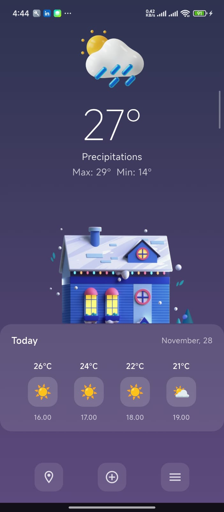
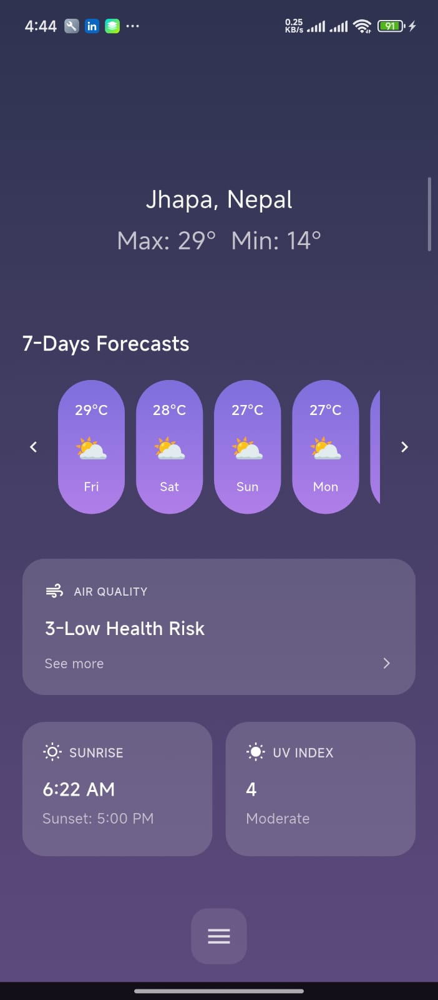

# Flutter Weather App

A simple, cross-platform Flutter weather application that shows current weather and forecast for a chosen location.

## Technologies

- Flutter (Dart)
- Provider (for State Management)
- Dio (for API calls)
- open-meteo.com API

## Quickstart / How to clone and run

1. Clone the repository:
   git clone https://github.com/roshankarki9000/weather_sushant.git
2. Change directory:
   cd weather_sushant
3. Install dependencies:
   flutter pub get
4. Run on a connected device or emulator:
   flutter run

## Project structure (example)

- lib/
  - main.dart
  -app_colors.dart
  - screens/
  - widgets/
  - services/ (API client)
  - models/
  - providers/
  - utils/
- assets/

## Screenshots

